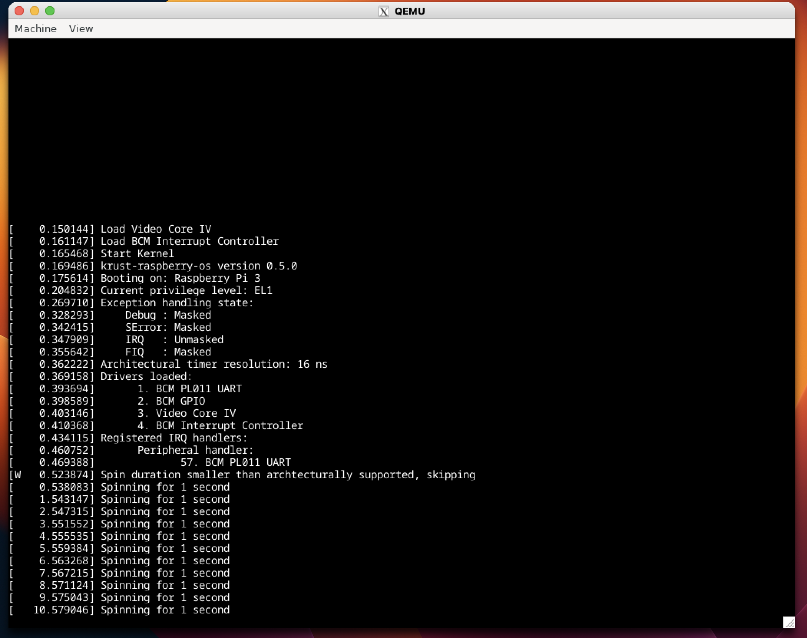

# krust-raspberry-os
This repository is a Raspberry PI OS with [the good tuorial for OS](https://github.com/rust-embedded/rust-raspberrypi-OS-tutorials) extended by Frame Buffer.
<!--  -->


# How to install
Please install the follwing softwares:
- [Docker](https://www.docker.com/)
- [VSCode](https://code.visualstudio.com/)
    - Add [Dev container extention](https://marketplace.visualstudio.com/items?itemName=ms-vscode-remote.remote-containers)


## How to use
You can open vscode and build the container of this repository.
And then, you can type the follwing commands.


```
# build OS
$ cargo build
```

```
# build and boot OS
$ cargo run
```

```
$ cargo objdump --bin kernel -- --disassemble --demangle --section .text --section .rodata --section .got  | rustfilt
```

```
$ cargo readobj --bin kernel -- --headers
```

## License
Licensed under of Apache License, Version 2.0, ([LICENSE-APACHE]() or http://www.apache.org/licenses/LICENSE-2.0)